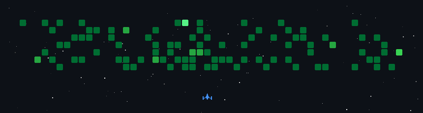

  

  
  
  

  

## 🛠 Stack

  

**ML/AI:** Python · TensorFlow · PyTorch · scikit-learn · LangChain  
**Geospatial:** Google Earth Engine · QGIS · Sentinel/Landsat  
**Web:** Next.js · TypeScript · React · Tailwind

## 📈 Stats

  
  
  

  
  
  
  
  
  
  

